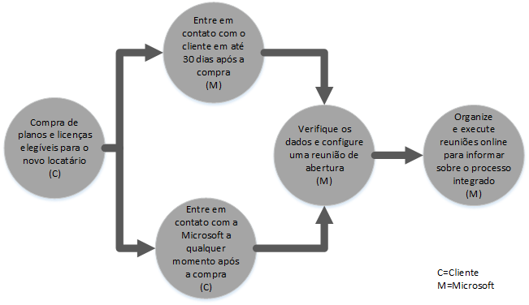
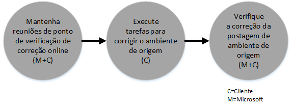
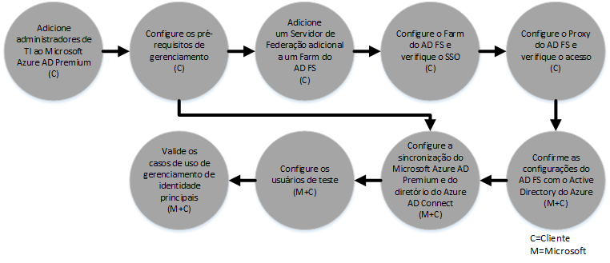

# Processo de Benef&#237;cio do FastTrack Center para Azure Rights Management
Se sua organização estiver qualificada para o benefício do FastTrack Center do Microsoft Azure Rights Management, você pode trabalhar remotamente com especialistas da Microsoft para tornar o seu ambiente do Azure RMS pronto para uso. Para saber se a sua organização é elegível, consulte [Benefício do FastTrack Center para Azure Rights Management](../Topic/FastTrack_Center_Benefit_for_Azure_Rights_Management.md).

Este artigo fornece as seguintes informações:

-   [Overview of the onboarding process](#overview_rms)

-   [Expectations for your source environment](#expectations_src_environ_rms)

-   [Phases of the onboarding process](#phases_onboarding_process_rms)

-   [Microsoft responsibilities](#microsoft_responsibilities_rms) para cada fase

-   [Your responsibilities](#your_responsibilities_rms) para cada fase

Eis o que você pode esperar quando a integração for concluída:

-   Seu locatário do Microsoft Azure RMS é criado.

-   Os usuários licenciados podem acessar os serviços do Azure RMS usando uma das seguintes opções de identidade:

    -   Identidades de nuvem (contas do AD do Microsoft Azure exclusivas).

    -   Identidades Sincronizadas: contas do AD do Microsoft Azure sincronizadas do seu Active Directory local com a ferramenta Azure Active Directory Connect (Azure AD Connect) para clientes com uma única floresta ou várias florestas do Active Directory.

    -   Identidades Federadas — com contas do AD do Microsoft Azure que são:

        -   Sincronizadas do Active Directory Connect com a ferramenta Microsoft Azure AD Connect para clientes com uma única configuração de floresta do Active Directory.

        -   Federadas com o AD FS 2.0 (Serviços de Federação do Active Directory) ou posterior do seu Active Directory local.

## Visão geral do processo de integração
A integração tem dois componentes principais:

-   **Principais recursos** - tarefas requeridas para a configuração de locatário e integração com o AD do Azure, se necessário. Os recursos de núcleo também fornecem a linha de base para integração de outros serviços qualificados da Microsoft Online.

-   **Integração de serviço** - tarefas necessárias para configurar o Azure RMS autônomo ou com sincronização de diretório do Azure AD Connect ou AD FS.

O diagrama a seguir descreve a linha do tempo para uso do benefício do FastTrack Center.

O processo básico é como descrito a seguir:

-   A Microsoft tentará entrar em contato com você dentro de 30 dias a partir da data em que você comprar um plano qualificado. Você também pode solicitar assistência do [Centro FastTrack](http://fasttrack.microsoft.com/) se estiver pronto para implantar esses serviços em sua organização. Para solicitar assistência, entre no Centro FastTrack (http://fasttrack.microsoft.com), vá para o painel, selecione o nome da empresa, clique na guia Ofertas e clique no botão de solicitação de assistência para o serviço qualificado.

-   A equipe da Microsoft ajudará você com os principais recursos e, em seguida, vai ajudá-lo a realizar a integração uma vez para cada serviço qualificado.

Todo o suporte à integração será fornecido remotamente por funcionários da Microsoft atribuídos a essa tarefa:

-   A Microsoft lhe ajudará remotamente com várias atividades de integração, usando uma combinação de ferramentas, documentação e orientação. Se desejar que a Microsoft execute certas tarefas de configuração para você, você poderá fornecer permissões e acesso apropriado à Microsoft para a realização dessas tarefas.

-   O suporte à integração é fornecido pelo Centro FastTrack e está disponível durante o horário comercial normal de uma determinada região.

-   Suporte de integração está disponível em chinês tradicional, inglês, francês, alemão, italiano, japonês, português (Brasil) ou espanhol.

-   A equipe da Microsoft pode trabalhar diretamente com você ou seu representante.

## Expectativas para o seu ambiente de origem
Você talvez já tenha o Microsoft Active Directory local no seu ambiente de origem que você deseja integrar com o Active Directory do Microsoft Azure para aproveitar o gerenciamento avançado de identidade de um único console. O benefício do FastTrack Center inclui ajudá-lo a integrar o Active Directory do Microsoft Azure com a implementação local existente. Se a integração for necessária, seu ambiente de origem deve estar em um nível mínimo para esse aplicativo.

A tabela a seguir mostra o que é esperado no seu ambiente de origem existente para integração.

|Atividade|Expectativa para o ambiente de origem|
|-------------|-----------------------------------------|
|Principais recursos|Florestas do Active Directory com o nível funcional de floresta definido como Windows Server 2008 ou superior, com a seguinte configuração de floresta:  -   Floresta única do Active Directory -   Várias florestas do Active Directory **Note:** Para todas as configurações com várias florestas, a implantação do AD FS está fora do escopo para o benefício do FastTrack Center.|
|Integração de serviço  -   Azure RMS|O Active Directory local e o ambiente foram preparados para o Azure RMS, que inclui a correção dos problemas identificados que poderiam impedir a integração com os recursos do AD do Azure e do Azure RMS.|

## Fases do processo de integração
A integração do Microsoft RMS tem cinco fases principais, conforme mostrado na figura a seguir:

-   Iniciar

-   Avaliar

-   Corrigir

-   Habilitar

-   Fechar

Para as tarefas detalhadas em cada fase, consulte as seções [Microsoft responsibilities](#microsoft_responsibilities_rms) e [Your responsibilities](#your_responsibilities_rms).

### Fase Iniciar
Depois que você tiver comprado o número de licenças apropriado, siga as diretrizes do email de confirmação de compra para associar as licenças ao seu locatário existente ou novo locatário. A Microsoft vai verificar sua qualificação para o benefício do FastTrack Center. A Microsoft tentará entrar em contato com você dentro de 30 dias a partir da data em que você comprar um plano qualificado. Você também pode solicitar assistência do [Centro FastTrack](http://fasttrack.microsoft.com/) se estiver pronto para implantar esses serviços em sua organização. Para solicitar assistência, entre no Centro FastTrack (http://fasttrack.microsoft.com), vá para o painel, selecione o nome da empresa, clique na guia Ofertas e clique no botão de solicitação de assistência para o serviço qualificado.

Durante essa fase, podemos discutir o processo de integração, verificar os dados e programar uma reunião inicial.

### Fase Avaliar
Quando começar o processo de integração, a Microsoft trabalhará com você para avaliar seu ambiente de origem e os requisitos. Ferramentas serão executadas para avaliar seu ambiente e a Microsoft vai guiá-lo pela avaliação de seus navegadores de Internet, Active Directory local, sistemas operacionais de dispositivos do cliente, DNS, rede, infraestrutura e sistema de identidade para determinar se são necessárias quaisquer alterações para integração. Com base na sua configuração atual, forneceremos um plano de correção que atualizará o seu ambiente de origem para os requisitos mínimos para integração bem-sucedida ao Azure RMS. Também configuraremos chamadas de ponto de verificação apropriadas para a fase de correção.

### Fase Corrigir
Se necessário, você realizará as tarefas no plano de correção no ambiente de origem para que você atenda aos requisitos para integração de cada serviço.

Antes de iniciar a fase Habilitar, verificaremos em conjunto os resultados das atividades de correção para garantir que você esteja pronto para continuar.

### Fase Habilitar
Quando todas as atividades de correção estiverem concluídas, o projeto muda para configuração da infraestrutura principal para consumo do serviço e para provisionamento do Azure RMS.

**Habilitar fase - principais recursos**

A habilitação dos principais recursos envolve o provisionamento de serviços e a integração de locatário e identidade. Ela também inclui etapas para fornecer uma base para a integração do Microsoft Azure RMS.

A integração do Azure RMS pode começar ao término da integração de núcleo.

**Habilitar fase – Azure RMS**

O ambiente Azure RMS pode ser configurado com a sincronização de diretório do Azure AD Connect e o AD FS (Serviços de Federação do Active Directory), conforme necessário.

Para cenários do Azure RMS que incluem a sincronização de identidades locais para a nuvem, nós o ajudaremos adicionando os administradores de TI e usuários à sua assinatura, configurando pré-requisitos de gerenciamento, configurando o Azure RMS, configurando a sincronização de diretório usando o Azure AD Connect e os Serviços de Federação do Active Directory usando o Azure AD Connect, configurando usuários de teste e validando os principais casos de uso para o serviço.

A instalação do Azure RMS inclui a habilitação dos recursos a seguir:

-   Habilitação de Serviço do RMS

-   Configuração do IRM para o Exchange Online e o Sharepoint Online

-   Conector do Rights Management com o Exchange local e o Sharepoint local

-   Dispositivos do aplicativo RMS sharing para dispositivos Windows e não Windows

## Responsabilidades da Microsoft

### Geral

-   Fornece assistência de suporte remoto para as atividades de configuração necessárias, conforme detalhado nas descrições de cada fase.

-   Fornece ferramentas de software e de documentação, consoles de administração e scripts disponíveis para ajudá-lo a reduzir ou eliminar tarefas de configuração.

Não é necessário fornecer acesso e permissões à Microsoft para usar o benefício do FastTrack Center. Em alguns casos, você pode optar por fornecer à Microsoft o acesso apropriado e permissões para executar atividades específicas em seu nome.

### Fase Iniciar

-   Entrar em contato com você dentro de 30 dias após a compra de licenças qualificadas para um novo locatário.

-   Defina quais serviços você deseja integrar.

### Fase Avaliar

-   Fornecimento de uma visão geral administrativa.

-   Fornecimento de orientação sobre:

    -   Necessidades de DNS, rede e infraestrutura.

    -   Necessidades do cliente (navegador de Internet, sistema operacional do cliente e necessidades dos serviços).

    -   Identidade do usuário e provisionamento.

    -   Identificação dos requisitos de sincronização de diretório.

    -   Habilitação de serviços elegíveis que foram adquiridos e definidos como parte da integração.

    -   Identificação dos requisitos do ambiente piloto e de teste necessários.

-   Estabelecimento da linha do tempo para atividades de correção.

-   Fornecimento de uma lista de verificação de correção.

### Fase Corrigir

-   Realização de teleconferências com você de acordo com a agenda definida para analisar o progresso das atividades de correção.

-   Ajudá-lo com a execução de ferramentas para identificar e corrigir problemas, além de ajudá-lo com a interpretação dos resultados.

### Fase Habilitar
Fornecimento de orientação sobre:

-   Ativando o locatário do Azure RMS.

-   Configuração das portas do firewall.

-   Configuração do DNS para serviços qualificados.

-   Validando a conectividade a serviços do Azure RMS.

-   Para um ambiente de floresta única:

    -   Instalação de uma sincronização de diretórios entre o AD DS (Serviços de Domínio do Active Directory) e o Azure AD Connect, se necessário.

    -   Configuração da sincronização de senha com a ferramenta Azure AD Connect.

-   Para um ambiente de várias florestas:

    -   Ao instalar a sincronização do Azure AD Connect, configure para vários cenários de floresta. Observe que a sincronização de hash de senha e write-back de senha dão suporte a várias florestas.  No entanto, não há suporte para outros cenários de write-back.

    -   Configure a sincronização entre florestas do Active Directory local e o diretório do AD do Microsoft Azure (Active Directory do Azure).

        > [!NOTE]
        > Desenvolvimento e implementação de extensões de regras personalizadas estão fora do escopo.

-   Para uma única floresta quando o destino for identidades federadas: instalação e configuração dos Serviços de Federação do Active Directory (AD FS) para autenticação de domínio local com o AD do Microsoft Azure em uma configuração de site único e tolerante a falhas, se necessário.

    > [!NOTE]
    > Para todas as configurações de várias florestas, as implantações do AD FS estão fora do escopo.

-   Teste da funcionalidade de SSO (logon único), se implantada.

-   Adicionando administradores de segurança de informações adicionais para gerenciar modelos.

-   Atribuir uma conta de superusuário para o Azure RMS.

-   Licenciando dois usuários piloto para o Azure RMS.

-   Configurando dois grupos de distribuição de teste para validar as políticas.

-   Configurando um modelo personalizado do Azure RMS para seu diretório.

-   Fornecendo diretrizes ao configurar a integração do SharePoint Online e o Exchange Online com o Azure RMS, incluindo:

    -   Configurando e validando a integração do Exchange Online com o Azure RMS.

    -   Configurando um regra de fluxo de email de teste para criptografar mensagens confidenciais enviadas a destinatários externos à sua organização.

    -   Configurando e validando a proteção do SharePoint Online de uma biblioteca de teste a ser protegida com o Azure RMS.

-   Configurar um servidor local com o conector RMS, quando aplicável:

    -   Configurando e validando a integração local do Exchange 2013/2010 com o Azure RMS.

    -   Instalando uma regra de fluxo de email de teste para criptografar mensagens confidenciais enviadas a destinatários externos à sua organização usando o conector.

    -   Configurando e validando a proteção local do SharePoint 2013/2010 de uma biblioteca de teste a ser protegida com o Azure RMS.

-   Instalando o aplicativo RMS sharing para dispositivos Windows e não Windows.

## Suas responsabilidades
Esta seção descreve algumas das suas responsabilidades durante o processo de integração.

### Geral

-   Quaisquer aperfeiçoamentos e integrações ao seu locatário do Azure RMS além das opções configuráveis listadas neste artigo.

-   Programa geral e gerenciamento de projeto de seus recursos.

-   Comunicações do usuário final, documentação, treinamento e gerenciamento de alterações.

-   Documentação de suporte técnico e treinamento.

-   Produção de quaisquer relatórios, apresentações ou minutos de reunião específicos para sua organização.

-   Criação de documentação técnica e de arquitetura específicas para sua organização.

-   Projeto, aquisição, instalação e configuração de hardware e rede.

-   Aquisição, instalação e configuração de software.

-   Gerenciamento, configuração e aplicação de políticas de segurança além daquelas criadas para testar a funcionalidade e a configuração de linha de base dos serviços do Azure RMS.

-   Registro de contas de usuário além daquelas usadas para testar a funcionalidade e configuração de linha de base de serviços do Azure RMS.

-   Configuração de rede, análise, validação de largura de banda, teste e monitoramento.

-   Gerenciamento de um processo de aprovação de gerenciamento de alterações técnicas e criação de documentação de suporte.

-   Modificação do seu modelo operacional e guias de operação.

-   Encerramento e remoção de ambientes de origem e serviços anteriormente usados pelo cliente.

-   Construção e manutenção de seu ambiente de teste.

-   Instalação de service packs e outras atualizações necessárias nos servidores de infraestrutura.

-   Fornecimento e configuração de quaisquer eventuais certificados SSL públicos.

-   Redação da TOU (declaração de termos de uso) da organização para ser configurada e exibida em dispositivos dos usuários finais.

### Fase Iniciar

-   Trabalhar com a equipe da Microsoft para começar a integração de serviços qualificados.

-   Participe da reunião de lançamento do contrato, gerencie e comande os participantes de sua organização e confirme os cronogramas de correção.

### Fase Avaliar

-   Identifique os participantes adequados (incluindo um gerente de projeto) para concluir as atividades de avaliação necessárias.

-   Se optar por fazê-lo, compartilhe sua tela com a Microsoft caso seja necessária diretrizes ao executar ferramentas de avaliação em seu ambiente ou sua assinatura do Azure RMS.

-   Participe de reuniões para criar a lista de verificação de correção e contribuir para o plano geral, incluindo infraestrutura, rede, administração, preparação para sincronização de diretório, segurança de rede e tópicos de identidade federada.

-   Participe de reuniões para traçar a abordagem de provisionamento do usuário.

-   Participe de reuniões para planejar a configuração do serviço online.

-   Crie um plano de suporte para preparação de migração.

### Fase Corrigir

-   Execute as etapas necessárias para concluir as atividades de correção identificadas na fase Avaliar.

-   Participe de reuniões em pontos de verificação.

### Fase Habilitar

-   Se optar por fazê-lo, compartilhe sua tela com a Microsoft caso seja necessário diretrizes ao executar ferramentas de avaliação em seu ambiente ou sua assinatura do Azure RMS.

-   Gerencie recursos conforme apropriado.

-   Configure itens relacionados à rede segundo as diretrizes da Microsoft.

-   Execute a preparação para o diretório e configure a sincronização de diretório segundo as orientações da Microsoft.

-   Configure infraestrutura relacionada à segurança (por exemplo, portas de firewall) segundo as diretrizes da Microsoft.

-   Implemente a infraestrutura de cliente apropriada.

-   Implemente uma abordagem de provisionamento de usuários segundo as diretrizes da Microsoft.

-   Habilite serviços diversos de acordo com as diretrizes da Microsoft.

## Quer saber mais?
Consulte [Microsoft Azure Rights Management](http://products.office.com/business/microsoft-azure-rights-management) e [Enterprise Mobility Suite](http://www.microsoft.com/en-us/server-cloud/products/enterprise-mobility-suite/default.aspx).

