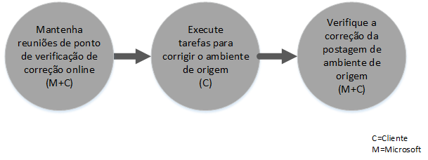

# Processo de Benef&#237;cio do Centro FastTrack para Intune
Se sua organização está qualificada para o benefício do serviço Microsoft Intune, você pode trabalhar remotamente com especialistas da Microsoft para tornar o seu ambiente do Microsoft Intune pronto para uso.

O Microsoft Intune é parte do Enterprise Mobility Suite (EMS) da Microsoft, que fornece os recursos do Enterprise Mobility Management (EMM), incluindo Gerenciamento de Dispositivo Móvel (MDM) e Gerenciamento de Aplicativo Móvel (MAM).  Você pode usar o Microsoft Intune para permitir que seus funcionários sejam produtivos em dispositivos móveis por meio do provisionamento de dispositivos, configuração de dispositivos e implantação de aplicativos móveis.  Além disso, você pode usar o Microsoft Intune para ajudar a proteger seus dados corporativos, monitorar a conformidade do dispositivo, proteção de dados e aplicativos móveis e integração com o AD do Azure para controlar o acesso a serviços corporativos.

Para saber se a sua organização está qualificada, consulte [Benefício do Centro FastTrack para Intune](../Topic/FastTrack_Center_Benefit_for_Intune.md). Caso queira que seu ambiente fique pronto para outros serviços do Enterprise Mobility Suite, consulte [Benefício do Centro FastTrack para Enterprise Mobility Suite](../Topic/FastTrack_Center_Benefit_for_Enterprise_Mobility_Suite.md).

**Procurando informações sobre o Microsoft FastTrack para Office 365? Consulte** [Benefícios do Centro FastTrack Center para o Office 365](https://technet.microsoft.com/library/office-365-onboarding-benefit.aspx).

Este artigo fornece as seguintes informações sobre o benefício do serviço do Microsoft Intune:

-   [Overview of the onboarding process](#overview_onboarding_process)

-   [Expectations for your source environment](#expectations_src_environ)

-   [Phases of the onboarding process](#phases_onboarding_process)

-   [Microsoft responsibilities](#microsoft_responsibilities) para cada fase

-   [Your responsibilities](#your_responsibilities) para cada fase

Eis o que você pode esperar quando a integração for concluída:

-   Seu locatário do Serviço Online da Microsoft é criado.

-   Os usuários licenciados podem acessar o serviço Microsoft Intune usando uma das seguintes opções de identidade:

    -   Identidades de nuvem (contas de serviço online Microsoft exclusivas).

    -   Identidades sincronizadas: contas do Microsoft Intune sincronizadas do Active Directory local com o Azure Active Directory Connect (Serviços de sincronização):

        -   Para clientes com um único ambiente de floresta do Active Directory.

        -   Para clientes com suporte à topologia do Active Directory de várias florestas.

-   Identidades federadas: — contas do Microsoft Intune:

    -   Sincronizadas do Active Directory com a ferramenta Microsoft Azure Active Directory Connect para clientes com uma única configuração de floresta do Active Directory ou para clientes com uma única floresta de conta do Active Directory (também conhecida como uma "floresta de logon") e uma única configuração de floresta de recursos do Active Directory.

    -   Federadas com a função do Windows Server 2012 R2 Active Directory Federation Services do seu Active Directory local ou federado com AD FS (Serviços de Federação do Active Directory) 2.0 ou posterior do seu Active Directory local.

## Visão geral do processo de integração
A integração tem dois componentes principais:

-   **Principais recursos** - tarefas requeridas para a configuração de locatário e integração com o AD do Azure, se necessário. O componente principais recursos também fornece a linha de base para integração de outros serviços qualificados.

-   **Integração de serviços** - tarefas necessárias para configuração do Microsoft Intune.

O diagrama a seguir descreve a sequência de eventos para uso do benefício do Centro FastTrack.

O processo básico é como descrito a seguir:

-   O Centro FastTrack tentará entrar em contato com você dentro de 30 dias a partir da data em que adquirir um plano qualificado. Você também pode solicitar assistência do [Centro FastTrack](http://fasttrack.microsoft.com/) se estiver pronto para implantar esses serviços em sua organização. Para solicitar assistência, entre no [Centro FastTrack](http://fasttrack.microsoft.com/), vá para o painel, selecione o nome da empresa, clique na guia Ofertas e clique no botão Solicitar Assistência para o Microsoft Intune, Azure Active Directory Premium ou Azure Rights Management Premium.

-   O Centro FastTrack ajudará você com os principais recursos e, em seguida, ajudará você a integrar única para cada serviço qualificado.

Todo o suporte à integração será fornecido remotamente por funcionários da Microsoft atribuídos a essa tarefa:

-   A Microsoft lhe ajudará remotamente com várias atividades de integração, usando uma combinação de ferramentas, documentação e orientação.

-   O suporte à integração é fornecido pelo Centro FastTrack e está disponível durante o horário comercial normal de uma determinada região.

-   Suporte de integração está disponível em chinês tradicional, inglês, francês, alemão, italiano, japonês, português (Brasil) ou espanhol.

-   A equipe da Microsoft pode trabalhar diretamente com você ou seu representante.

## Expectativas para o seu ambiente de origem
Você pode já ter serviços em seu ambiente de origem que deseja mover para seu serviço Microsoft Intune ou que deseja integrar a ele. Para alguns serviços, o benefício de Centro FastTrack para o Intune inclui ajudar você a configurar um determinado nível de integração com o seu ambiente de origem. Se a integração for necessária, seu ambiente de origem deve estar em um nível mínimo para esse aplicativo.

A tabela a seguir mostra o que é esperado no seu ambiente de origem existente para integração.

|Atividade|Expectativa para o ambiente de origem|
|-------------|-----------------------------------------|
|Principais recursos|Florestas do Active Directory com o nível funcional de floresta definido como Windows Server 2008 ou superior, com a seguinte configuração de floresta:  -   Floresta única do Active Directory -   Várias florestas do Active Directory **Note:** Para todas as configurações com várias florestas, a implantação do AD FS está fora do escopo para o benefício de Centro FastTrack.|
|Integração de serviço  -   Microsoft Intune -   Microsoft Intune integrado ao System Center Configuration Manager|Gerenciamento de dispositivos com o System Center Configuration Manager 2012 R2 ou posterior conectado ao Microsoft Intune, os administradores de TI precisarão seguir a [Lista de verificação do administrador: configuração do Configuration Manager para gerenciar dispositivos móveis usando o Microsoft Intune](https://technet.microsoft.com/library/jj943763.aspx). **Note:** O benefício do serviço não inclui assistência para configurar ou atualizar o System Center Configuration Manager para os requisitos mínimos necessários para o Microsoft Intune integrado com o System Center Configuration Manager.|

## Fases do processo de integração
A integração tem quatro fases principais:

-   Iniciar

-   Avaliar

-   Corrigir

-   Habilitar

Para as tarefas detalhadas em cada fase, consulte as seções [Microsoft responsibilities](#microsoft_responsibilities) e [Your responsibilities](#your_responsibilities).

### Fase Iniciar
Depois que você tiver comprado o número e tipos de licenças apropriados, siga as orientações do email de confirmação de compra para associar as licenças ao seu locatário existente ou novo locatário. O Centro FastTrack vai verificar sua qualificação para o benefício de serviço. A Microsoft tentará entrar em contato com você dentro de 30 dias a partir da data em que você comprar um plano qualificado. Você também pode solicitar assistência do [Centro FastTrack](http://fasttrack.microsoft.com/) se estiver pronto para implantar esses serviços em sua organização. Para solicitar assistência, entre no [Centro FastTrack](http://fasttrack.microsoft.com/), vá para o painel, selecione o nome da empresa, clique na guia Ofertas e clique no botão Solicitar Assistência para o Microsoft Intune, Azure Active Directory Premium ou Azure Rights Management Premium.

Durante essa fase, podemos discutir o processo de integração, verificar os dados e programar uma reunião inicial.

### Fase Avaliar
Quando começar o processo de integração, a Microsoft trabalhará com você para avaliar seu ambiente de origem e os requisitos. Ferramentas serão executadas para avaliar seu ambiente e a Microsoft vai guiá-lo pela avaliação de seus navegadores de Internet, sistemas operacionais, DNS, rede, infraestrutura e sistema de identidade para determinar se são necessárias quaisquer alterações para integração. Com base na sua configuração atual, forneceremos um plano de correção que atualizará o seu ambiente de origem para os requisitos mínimos para integração bem-sucedida ao Microsoft Intune. Também configuraremos chamadas de ponto de verificação apropriadas para a fase de correção.

### Fase Corrigir
Se necessário, você realizará as tarefas no plano de correção no ambiente de origem para que você atenda aos requisitos para integração de cada serviço.

Antes de iniciar a fase Habilitar, verificaremos em conjunto os resultados das atividades de correção para garantir que você esteja pronto para continuar.

### Fase Habilitar
Quando todas as atividades de correção estiverem concluídas, o projeto muda para configuração da infraestrutura básica para consumo do serviço e para provisionamento do Microsoft Intune.

**Habilitar fase - principais recursos**

A habilitação dos principais recursos envolve o provisionamento de serviços e a integração de locatário e identidade. Ela também inclui etapas para fornecer uma base para integração do Microsoft Intune.

A integração do Microsoft Intune pode começar ao término da habilitação dos principais recursos.

**Fase Habilitar – Microsoft Intune**

Para o Microsoft Intune, e com base em seu dispositivo móvel e nas necessidades de gerenciamento de aplicativos móveis, vamos orientá-lo sobre como preparar-se para usar o Microsoft Intune para gerenciar dispositivos. As etapas exatas dependem de seu ambiente de origem e podem incluir:

-   Licenciamento dos usuários finais. Quando necessário, também forneceremos assistência sobre como ativar licenças de volume para seu locatário de serviço de nuvem da Microsoft.

-   Configurando identidades que serão usadas pelo Microsoft Intune, aproveitando as identidades locais de nuvem ou do Active Directory.

-   Adicionando usuários à sua assinatura do Microsoft Intune, definindo funções de administrador de TI e criando grupos de usuários e dispositivos.

-   Com base em suas necessidades de gerenciamento, configurando a autoridade de Gerenciamento de Dispositivo Móvel:

    -   Configure o Microsoft Intune como sua autoridade MDM quando o Microsoft Intune for sua única solução MDM ou se estiver em conjunto com o gerenciamento de dispositivo móvel do Office 365.

    -   Se você tiver uma implementação existente do System Center Configuration Manager e quiser para expandir seus recursos de gerenciamento com o Microsoft Intune, configure o Configuration Manager como sua autoridade MDM.

        > [!NOTE]
        > Se você estiver procurando apenas aproveitar o Gerenciamento de Aplicativo Móvel nos dispositivos próprios, dispositivos compartilhados ou dispositivos de quiosque de seus usuários finais, a configuração de uma autoridade MDM não é necessária.

-   Se o Gerenciamento de Dispositivo Móvel estiver no seu escopo, forneceremos orientações com:

    -   Configuração de grupos de testes a serem usados para validar as políticas de gerenciamento do MDM.

    -   Configuração de políticas de gerenciamento do MDM e serviços, como:

        -   Implantação de aplicativo para cada plataforma com suporte por meio de links da web ou links profundos.

        -   Políticas de acesso condicional.

        -   Implantação de perfis de email.

        -   Configuração do Microsoft Intune Exchange Connector, quando aplicável.

    -   Registro de até dois dispositivos de teste de cada [plataforma com suporte](https://technet.microsoft.com/library/dn600287.aspx) para o Microsoft Intune ou Configuration Manager com o serviço Microsoft Intune.

    -   Usando relatórios de inventário de hardware e software.

-   Se o Gerenciamento de Aplicativo Móvel (MAM) estiver no seu escopo, ou se você estiver procurando complementar seu Microsoft existente ou solução MDM de terceiros com políticas MAM, forneceremos orientações com:

    -   Configuração de políticas de MAM para cada plataforma com suporte.

    -   Configuração de políticas de acesso condicional para aplicativos gerenciados.

    -   Direcionamento dos grupos de usuários apropriado com as políticas MAM acima.

    -   Utilização de relatórios de uso de aplicativos gerenciados.

-   Se o gerenciamento de PCs estiver no seu escopo, forneceremos orientações para:

    -   Quando necessário, instalar o software cliente do Intune.

    -   Uso dos relatórios de hardware e software disponíveis no Intune.

## Responsabilidades da Microsoft
Esta seção descreve algumas das responsabilidades da Microsoft durante o processo de integração.

### Geral

-   Fornecer assistência via suporte remoto a você para as atividades de configuração necessárias conforme listado nas descrições detalhadas de fase.

-   Fornece ferramentas de software e de documentação, consoles de administração e scripts disponíveis para ajudá-lo a reduzir ou eliminar tarefas de configuração.

### Fase Iniciar

-   Entrar em contato com você dentro de 30 dias após a compra de licenças qualificadas para um novo locatário.

-   Trabalhar com você para começar a integração.

-   Defina quais serviços você deseja integrar.

### Fase Avaliar

-   Fornecimento de uma visão geral administrativa.

-   Fornecimento de orientação sobre:

    -   Necessidades de DNS, rede e infraestrutura.

    -   Necessidades do cliente (navegador de Internet, sistema operacional do cliente e necessidades dos serviços).

    -   Identidade do usuário e provisionamento.

    -   Habilitação de serviços elegíveis que foram adquiridos e definidos como parte da integração.

-   Estabelecimento da linha do tempo para atividades de correção.

-   Fornecimento de uma lista de verificação de correção.

### Fase Corrigir

-   Realização de teleconferências com você de acordo com a agenda definida para analisar o progresso das atividades de correção.

-   Ajudá-lo com a execução de ferramentas para identificar e corrigir problemas, além de ajudá-lo com a interpretação dos resultados.

### Fase Habilitar
Fornecimento de orientação sobre:

-   Ativação de seu locatário do Serviço Online da Microsoft.

-   Configuração de protocolos TCP/IP e portas de firewall.

-   Configuração do DNS para serviços qualificados.

-   Validação de conectividade para serviços online da Microsoft.

-   Para um ambiente de floresta única:

    -   Instalação de um servidor de sincronização de diretórios entre seus Serviços de Domínio do Active Directory (AD DS) e do(s) serviço(s) online da Microsoft qualificado(s), se necessário.

    -   Configuração da sincronização de senha (hash de senha) para o Microsoft Intune (Active Directory do Azure) com a ferramenta Azure Active Directory Connect.

        > [!NOTE]
        > Desenvolvimento e implementação de extensões de regras personalizadas estão fora do escopo.

-   Para uma única floresta quando o destino são identidades federadas: Instalação e configuração dos Serviços de Federação do Active Directory (AD FS) para autenticação de domínio local com o Microsoft Intune em uma configuração de site único e tolerante a falhas, se necessário.

    > [!NOTE]
    > Para todas as configurações de várias florestas, as implantações do AD FS estão fora do escopo.

-   Teste da funcionalidade de SSO (logon único) se implantada.

#### Fase habilitar - Microsoft Intune
Fornecimento de orientação sobre:

-   Licenciamento dos usuários finais. Quando necessário, também forneceremos assistência sobre como ativar licenças de volume para seu locatário de serviço de nuvem da Microsoft.

-   Configuração de identidades a serem usadas pelo Microsoft Intune, aproveitando suas identidades de nuvem ou do Active Directory local.

-   Adicionar usuários à sua assinatura do Microsoft Intune, definição de funções de administrador de TI e criação de grupos de usuários e dispositivos.

-   Com base em suas necessidades de gerenciamento, configurando a autoridade de Gerenciamento de Dispositivo Móvel:

    -   Configure o Microsoft Intune como sua autoridade MDM quando o Microsoft Intune for sua única solução MDM ou se estiver em conjunto com o gerenciamento de dispositivo móvel do Office 365.

    -   Se você tiver uma implementação existente do System Center Configuration Manager e quiser para expandir seus recursos de gerenciamento com o Microsoft Intune, configure o Configuration Manager como sua autoridade MDM.

        > [!NOTE]
        > Se você estiver apenas procurando aproveitar o Gerenciamento de Aplicativo Móvel nos dispositivos compartilhados, de quiosque ou compartilhados dos seus usuários finais, a configuração de uma autoridade MDM não é necessária.

-   Se o Gerenciamento de Dispositivo Móvel estiver no seu escopo, forneceremos orientações com:

    -   Configuração de grupos de testes a serem usados para validar as políticas de gerenciamento do MDM.

    -   Configuração de políticas de gerenciamento do MDM e serviços, como:

        -   Implantação de aplicativo para cada plataforma com suporte por meio de links da web ou links profundos.

        -   Políticas de acesso condicional.

        -   Implantação de perfis de email.

        -   Configuração do Microsoft Intune Exchange Connector, quando aplicável.

    -   Registro de até dois dispositivos de teste de cada plataforma com suporte para o Microsoft Intune ou Configuration Manager com o serviço Microsoft Intune.

    -   Uso de relatórios de inventário de hardware e software.

-   Se o Gerenciamento de Aplicativo Móvel (MAM) estiver no seu escopo, ou se você estiver procurando complementar a solução MDM de terceiros existente com as políticas de MAM, forneceremos orientações para:

    -   Configuração de políticas de MAM para cada plataforma com suporte.

    -   Configuração de políticas de acesso condicional para aplicativos gerenciados.

    -   Direcionamento dos grupos de usuários apropriado com as políticas MAM acima.

    -   Utilização de relatórios de uso de aplicativos gerenciados.

-   Se o gerenciamento de PCs estiver no seu escopo, forneceremos orientações para:

    -   Quando necessário, instalar o software cliente do Intune.

    -   Uso dos relatórios de hardware e software disponíveis no Intune.

## Suas responsabilidades
Esta seção descreve algumas das suas responsabilidades durante o processo de integração.

### Geral

-   Quaisquer aperfeiçoamentos e integrações ao seu locatário de serviço Online da Microsoft além das opções configuráveis listadas neste artigo.

-   Programa geral e gerenciamento de projeto de seus recursos.

-   Comunicações do usuário final, documentação, treinamento e gerenciamento de alterações.

-   Documentação de suporte técnico e treinamento.

-   Produção de quaisquer relatórios, apresentações ou minutos de reunião específicos para sua organização.

-   Criação de documentação técnica e de arquitetura específicas para sua organização.

-   Projeto, aquisição, instalação e configuração de hardware e rede.

-   Aquisição, instalação e configuração de software.

-   Configuração, empacotamento e distribuição do software cliente necessário para o Microsoft Intune.

-   Ativação de dispositivos móveis.

-   Configuração de rede, análise, validação de largura de banda, teste e monitoramento.

-   Gerenciamento de um processo de aprovação de gerenciamento de alterações técnicas e criação de documentação de suporte.

-   Especificação e definição de políticas de grupo para gerenciamento de usuário, estação de trabalho e servidor.

-   Modificação do seu modelo operacional e guias de operação.

-   Configuração da autenticação multifator.

-   Encerramento e remoção de ambientes de origem (como outras soluções de gerenciamento de PC ou dispositivo).

-   Construção e manutenção de seu ambiente de teste.

-   Instalação de service packs e outras atualizações necessárias nos servidores de infraestrutura.

-   Fornecimento e configuração de quaisquer eventuais certificados SSL públicos.

-   Redação da declaração de termos de uso (TOU) da organização a ser configurada e exibida em portais da empresa Microsoft Intune acessíveis aos usuários finais.

### Fase Iniciar

-   Trabalhar com a equipe da Microsoft para começar a integração de serviços qualificados.

-   Participe da reunião de lançamento do contrato, gerencie e comande os participantes de sua organização e confirme os cronogramas de correção.

### Fase Avaliar

-   Identifique os participantes adequados (incluindo um gerente de projeto) para concluir as atividades de avaliação necessárias.

-   Se optar por fazê-lo, compartilhe sua tela com a Microsoft caso seja necessária orientação ao executar ferramentas de avaliação em seu ambiente ou sua assinatura do Microsoft Intune.

-   Participe de reuniões para criar a lista de verificação de correção e contribuir para o plano geral, incluindo infraestrutura, rede, administração, preparação para sincronização de diretório, segurança de rede e tópicos de identidade federada.

-   Participe de reuniões para traçar a abordagem de provisionamento do usuário.

-   Participe de reuniões para planejar a configuração do serviço online.

-   Crie um plano de suporte para preparação de migração.

### Fase Corrigir

-   Execute as etapas necessárias para concluir as atividades de correção identificadas na fase Avaliar.

-   Participe de reuniões em pontos de verificação.

### Fase Habilitar

-   Se optar por fazê-lo, compartilhe sua tela com a Microsoft caso seja necessária orientação ao efetuar mudanças em seu ambiente ou sua assinatura de serviço online Microsoft.

-   Gerencie recursos conforme apropriado.

-   Configure itens relacionados à rede segundo as diretrizes da Microsoft.

-   Execute a preparação para o diretório e configure a sincronização de diretório segundo as orientações da Microsoft.

-   Configure infraestrutura relacionada à segurança (por exemplo, portas de firewall) segundo as diretrizes da Microsoft.

-   Implemente a infraestrutura de cliente apropriada.

-   Implemente uma abordagem de provisionamento de usuários segundo as diretrizes da Microsoft.

-   Habilite serviços diversos de acordo com as diretrizes da Microsoft.

-   Trabalhe com a Microsoft para concluir a integração de todos os serviços qualificados em 12 meses a partir do início da integração.

-   Ao habilitar o gerenciamento de PC ou dispositivo móvel com o Microsoft Intune, use dispositivos de teste ao habilitar as políticas de gerenciamento por meio do Microsoft Intune. Se os dispositivos de teste não estão disponíveis, os clientes são responsáveis por fazer backup e, se necessário, restaurar todo o conteúdo dos dispositivos usados durante a fase Habilitar do Microsoft Intune.

-   Selecione até dois aplicativos para cada plataforma com suporte no Microsoft Intune que possa ser implantada por meio de links da Web ou links internos (links profundos).

-   Gerenciamento, configuração e aplicação de políticas de segurança além daquelas usadas para testar a funcionalidade e a configuração de linha de base dos serviços Microsoft Intune.

## Quer saber mais?
Consulte [Microsoft Intune](http://www.microsoft.com/en-us/server-cloud/products/microsoft-intune/default.aspx) e [Enterprise Mobility Suite](http://www.microsoft.com/en-us/server-cloud/products/enterprise-mobility-suite/default.aspx).

